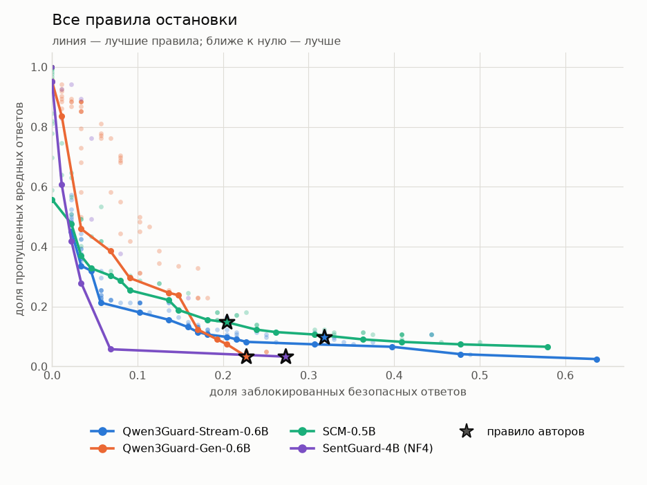
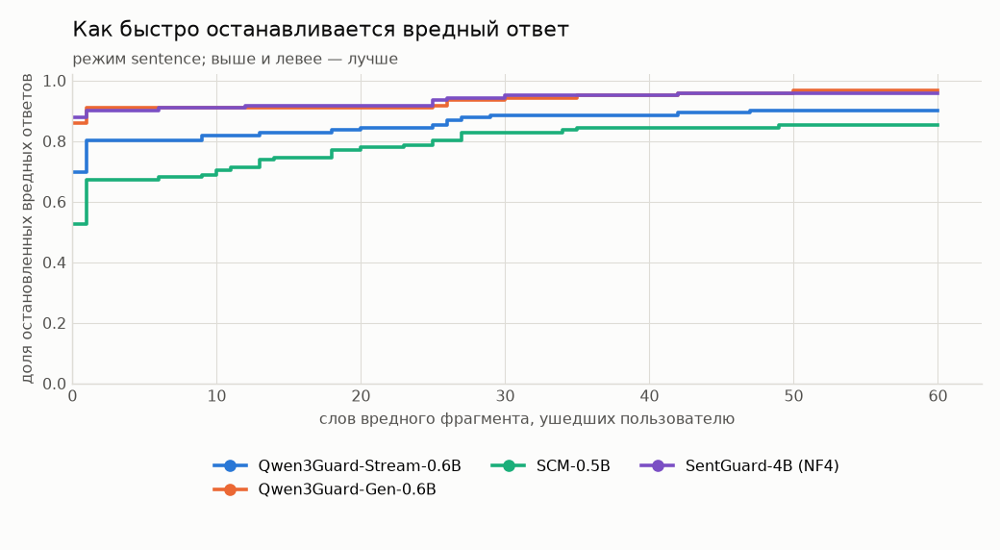
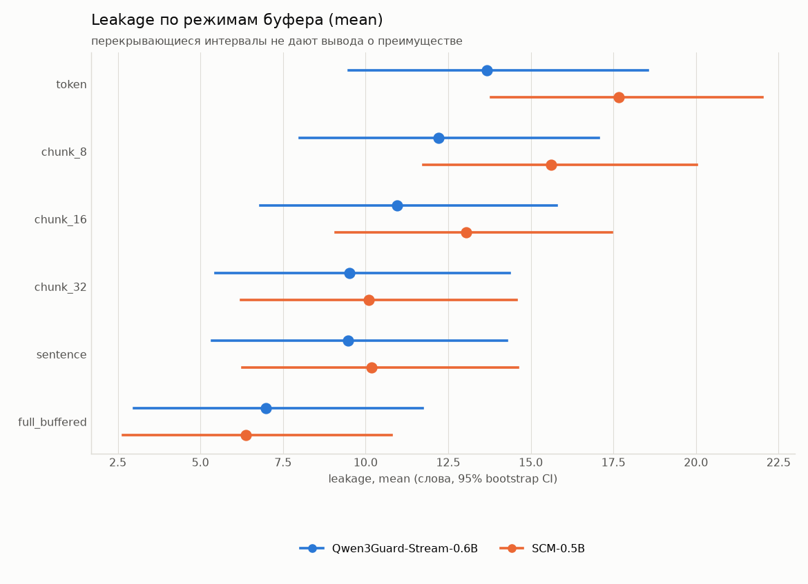

# SingStreamBench: бенчмарк потоковых guardrail-моделей

Языковая модель отдаёт ответ по частям, и пользователь читает текст ещё до того, как
ответ дописан. Защитная модель (guard) читает тот же поток и должна остановить выдачу
раньше, чем опасный фрагмент попадёт на экран.

Этот репозиторий измеряет, насколько хорошо guard-модели с этим справляются: как часто
они блокируют безопасные ответы, как часто пропускают опасные и сколько опасного текста
успевает уйти пользователю. Проверены две модели:
[Qwen3Guard-Stream-0.6B](https://huggingface.co/Qwen/Qwen3Guard-Stream-0.6B) и
[SCM-0.5B](https://huggingface.co/liyang-ict/SCM-0.5B).

## Как устроен эксперимент

- **Данные.** [SingStreamBench](https://huggingface.co/datasets/inclusionAI/SingStreamBench):
  210 вручную проверенных диалогов. В 122 ответ опасен, и размечено место, с которого он
  становится опасным (onset). В 88 ответ безопасен, хотя запрос почти всегда опасный.
- **Оценка.** Guard оценивает каждый токен ответа один раз. Эти решения сохраняются и
  затем переигрываются с разными правилами остановки и разными буферами, без повторного
  запуска модели.
- **Правило остановки** решает, сколько помеченных токенов и в каком порядке нужно,
  чтобы прервать поток. Мы не придумываем эти правила: для каждой модели берётся то,
  которое описали её авторы.
  - **Qwen3Guard-Stream:** два токена подряд с меткой `unsafe` или `controversial`
    ([отчёт Qwen3Guard](https://arxiv.org/abs/2510.14276)).
  - **SCM:** четыре токена с вероятностью вреда не ниже 0,7 в любом месте ответа,
    подряд они идти не обязаны
    ([статья SCM](https://arxiv.org/abs/2506.09996), значения для модели 0.5B).

  Другие правила тоже проверяются, но только как анализ чувствительности: выбирать
  правило по тем же данным, на которых оно оценивается, нельзя.
- **Буфер** задерживает выдачу: текст показывается пользователю сразу, порциями по 8–32
  токена, по предложениям или только целиком.
- **Утечка** (leakage) — сколько слов опасного фрагмента пользователь получил до
  остановки.

Подробности и словарь терминов — в [`docs/methodology.md`](docs/methodology.md).

## С чего начать

- [`docs/setup.md`](docs/setup.md) — как собрать окружение, запустить прогон, поменять
  правило остановки и подключить новую модель;
- [`01_singstreambench_eda.ipynb`](notebooks/01_singstreambench_eda.ipynb) — что за
  датасет, откуда он и почему ему можно доверять;
- [`02_streaming_benchmark.ipynb`](notebooks/02_streaming_benchmark.ipynb) — разбор
  прогона Qwen3Guard-Stream;
- [`04_scm_benchmark.ipynb`](notebooks/04_scm_benchmark.ipynb) — разбор прогона SCM-0.5B;
- [`06_model_comparison.ipynb`](notebooks/06_model_comparison.ipynb) — сравнение всех
  моделей на одних и тех же трассах.

Ноутбуки сохранены вместе с выводами: таблицы и графики видны при открытии файла,
запускать модель для этого не нужно. Свободные номера оставлены под ноутбуки следующих
моделей.

## Результаты

### Модели ошибаются по-разному, но в основном из-за разных правил

| С правилами авторов | Qwen3Guard-Stream-0.6B | SCM-0.5B |
|---|---|---|
| Безопасных ответов заблокировано, из 88 | 28 | 18 |
| Опасных ответов пропущено, из 122 | 12 | 18 |
| Медианная задержка после onset, токенов | 8 | 13 |
| Утечка без буфера, слов в среднем | 13,7 | 17,7 |

SCM реже блокирует безопасные ответы, Qwen3Guard-Stream реже пропускает опасные. Но
правила авторов задают разную строгость. На графике каждая точка — одно правило
остановки, линия соединяет лучшие правила модели, звезда отмечает правило авторов.

Кривые двух моделей идут рядом, а звёзды стоят в разных местах почти одной и той же
кривой. Если подобрать правила так, чтобы обе модели блокировали по 18 безопасных
ответов, ни одно различие между ними на этих данных не подтверждается.

### Правило остановки меняет результат сильнее, чем выбор модели

У Qwen3Guard-Stream остановка на первом же помеченном токене даёт 42 ложные блокировки
и 9 пропусков, а требование четырёх токенов — 18 и 12. Ни одно правило не делает малыми
обе ошибки сразу.

### Опасный текст успевает уйти, даже когда guard срабатывает

Без буфера Qwen3Guard-Stream останавливает 70% опасных ответов, пока пользователь
получил не больше десяти слов опасного фрагмента, SCM — 43%. SCM помечает отдельные
слова, и ему нужно время, чтобы набрать четыре флага. Обе кривые не доходят до единицы:
часть опасных ответов модели не останавливают вовсе.

### Буфер уменьшает утечку, но не исправляет ошибки модели

Выдача по предложениям или порциями по 32 токена снижает среднюю утечку примерно до
10 слов у обеих моделей, полная буферизация — до 6–7. Остаток дают пропущенные ответы,
которые уходят пользователю целиком. На ложные блокировки буфер не влияет.

## Ограничения

- **Мало данных.** 210 трасс дают широкие интервалы: разницу в несколько пропусков или
  слов утечки на них нельзя отличить от случайности.
- **Правила подобраны на тех же трассах.** Сравнение при равной строгости выбирает
  правило и оценивает его на одних данных. Нужен отдельный набор для подбора.
- **Граница опасного фрагмента размечена с точностью до предложения**, поэтому задержки
  в несколько токенов измерены грубо.
- **Датасет построен с участием моделей семейства Qwen**, что может давать
  Qwen3Guard-Stream преимущество.
