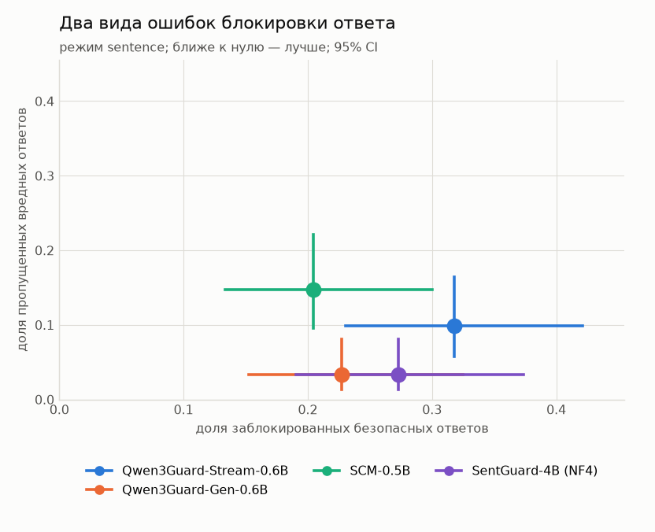
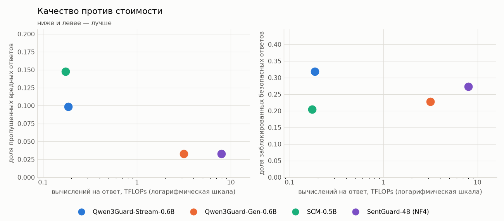
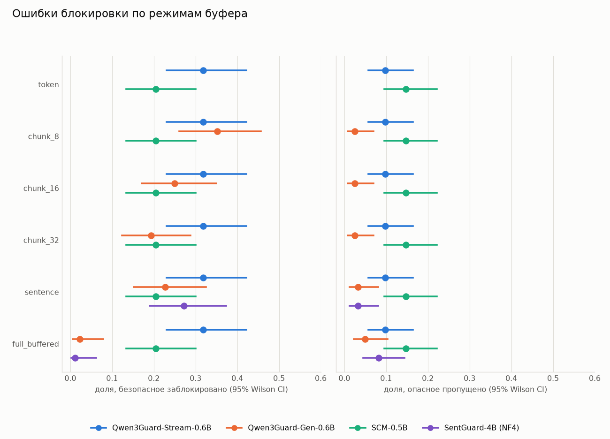

# SingStreamBench: бенчмарк потоковых guardrail-моделей

Языковая модель отдаёт ответ по частям, и пользователь читает текст ещё до того, как
ответ дописан. Защитная модель (guard) читает тот же поток и должна остановить выдачу
раньше, чем опасный фрагмент попадёт на экран.

Этот репозиторий измеряет, насколько хорошо guard-модели с этим справляются: как часто
они блокируют безопасные ответы, как часто пропускают опасные, сколько опасного текста
успевает уйти пользователю и сколько вычислений это стоит. Проверены четыре модели:

| Модель | Параметров | Как читает ответ |
|---|---|---|
| [Qwen3Guard-Stream-0.6B](https://huggingface.co/Qwen/Qwen3Guard-Stream-0.6B) | 0,6 млрд | поток, каждый токен один раз |
| [SCM-0.5B](https://huggingface.co/liyang-ict/SCM-0.5B) | 0,5 млрд | поток, каждый токен один раз |
| [Qwen3Guard-Gen-0.6B](https://huggingface.co/Qwen/Qwen3Guard-Gen-0.6B) | 0,6 млрд | заново читает префикс ответа в точках проверки |
| [SentGuard](https://huggingface.co/Solitude0630/SentGuard) | 4 млрд, квантизация NF4 | заново читает префикс ответа в конце предложения |

## Как устроен эксперимент

- **Данные.** [SingStreamBench](https://huggingface.co/datasets/inclusionAI/SingStreamBench):
  210 вручную проверенных диалогов. В 122 ответ опасен, и размечено место, с которого он
  становится опасным (onset). В 88 ответ безопасен, хотя запрос почти всегда опасный.
- **Два типа моделей.** Потоковая модель оценивает каждый токен ответа один раз.
  Префиксная получает запрос и уже готовую часть ответа и выносит один вердикт; её
  вызывают в точках проверки. Решения сохраняются и затем переигрываются с разными
  правилами остановки и буферами, без повторного запуска модели.
- **Правило остановки** решает, сколько блокирующих решений и в каком порядке нужно,
  чтобы прервать поток. Мы не придумываем эти правила: для каждой модели берётся то,
  которое описали её авторы.
  - **Qwen3Guard-Stream:** два токена подряд с меткой `unsafe` или `controversial`
    ([отчёт Qwen3Guard](https://arxiv.org/abs/2510.14276)).
  - **SCM:** четыре токена с вероятностью вреда не ниже 0,7 в любом месте ответа,
    подряд они идти не обязаны
    ([статья SCM](https://arxiv.org/abs/2506.09996), значения для модели 0.5B).
  - **SentGuard:** первый вердикт, отличный от `safe`
    ([статья SentGuard](https://arxiv.org/abs/2606.02041)).
  - **Qwen3Guard-Gen:** авторского правила для потока нет, модель задумана для готового
    текста. Здесь поток останавливает первый блокирующий вердикт.

  Другие правила тоже проверяются, но только как анализ чувствительности: выбирать
  правило по тем же данным, на которых оно оценивается, нельзя.
- **Политика** задаёт, какие метки блокируют. `strict` — `unsafe` и `controversial`
  (у SentGuard `uncertain`), `conservative` — только `unsafe`. Основная политика —
  `strict`, как у авторов моделей; вторая показана рядом.
- **Буфер** задерживает выдачу: текст показывается пользователю сразу, порциями по 8–32
  токена, по предложениям или только целиком. Для префиксной модели буфер задаёт ещё и
  частоту проверок. Модели сравниваются при выдаче по предложениям: этот режим есть у
  всех четырёх.
- **Утечка** (leakage) — сколько слов опасного фрагмента пользователь получил до
  остановки.
- **Вычисления** — сколько токенов модель обработала на один ответ, и оценка в FLOPs.
  Прогоны сделаны на разных машинах, поэтому время в миллисекундах не сравнивается.

Подробности и словарь терминов — в [`docs/methodology.md`](docs/methodology.md).

## С чего начать

- [`docs/setup.md`](docs/setup.md) — как собрать окружение, запустить прогон, поменять
  правило остановки и подключить новую модель;
- [`01_singstreambench_eda.ipynb`](notebooks/01_singstreambench_eda.ipynb) — что за
  датасет, откуда он и почему ему можно доверять;
- [`02_streaming_benchmark.ipynb`](notebooks/02_streaming_benchmark.ipynb) — разбор
  прогона Qwen3Guard-Stream;
- [`03_sentguard_benchmark.ipynb`](notebooks/03_sentguard_benchmark.ipynb) — разбор
  прогона SentGuard;
- [`04_scm_benchmark.ipynb`](notebooks/04_scm_benchmark.ipynb) — разбор прогона SCM-0.5B;
- [`05_qwen3guard_gen_benchmark.ipynb`](notebooks/05_qwen3guard_gen_benchmark.ipynb) —
  разбор прогона Qwen3Guard-Gen;
- [`06_model_comparison.ipynb`](notebooks/06_model_comparison.ipynb) — сравнение всех
  моделей на одних и тех же трассах.

Ноутбуки сохранены вместе с выводами: таблицы и графики видны при открытии файла,
запускать модель для этого не нужно.

## Результаты

Главное:

- **Потоковые модели дешёвые, но пропускают минимум втрое больше вредных ответов**, чем
  префиксные: 12 и 18 из 122 против 4.
- **Префиксные модели точнее, но требуют в 17–43 раза больше вычислений** и на неполном
  ответе ошибаются заметно чаще, чем на готовом.
- **Среди моделей около 0,5 млрд параметров правило остановки влияет на ошибки сильнее,
  чем выбор модели.** При равной строгости различия между ними не подтверждаются.
- **Ни одна модель не делает малыми обе ошибки сразу.** Лучший результат — 6 ложных
  блокировок и 7 пропусков у SentGuard с мягкой политикой, на модели в 4 млрд параметров.

Таблица: правила авторов, политика `strict`, выдача по предложениям.

| Модель | Ложных блокировок, из 88 | Пропусков, из 122 | Утечка, слов | Вычислений, TFLOPs |
|---|---|---|---|---|
| Qwen3Guard-Stream-0.6B | 28 | 12 | 9,5 | 0,18 |
| SCM-0.5B | 18 | 18 | 10,2 | 0,17 |
| Qwen3Guard-Gen-0.6B | 20 | 4 | 3,6 | 3,1 |
| SentGuard (NF4) | 24 | 4 | 4,6 | 8,0 |

### Префиксные модели пропускают меньше, но стоят на порядок дороже

Qwen3Guard-Gen и SentGuard пропускают по 4 вредных ответа из 122, потоковые модели — 12
и 18. Утечка у них вдвое меньше. Для Qwen3Guard-Gen против обеих потоковых моделей это
различие подтверждается парным сравнением на одних трассах. По ложным блокировкам
подтверждённых различий между моделями нет.

Платят за это вычислениями. Потоковая модель читает каждый токен один раз. Префиксная
при каждой проверке заново читает инструкцию, запрос и весь префикс: Qwen3Guard-Gen
обрабатывает в 17 раз больше токенов, чем Qwen3Guard-Stream того же размера, SentGuard
требует в 43 раза больше операций. KV-кэш сократил бы разрыв примерно вдвое.

### Неполный ответ оценить труднее, чем готовый

У потоковых моделей ошибки от буфера не зависят. У префиксных зависят: на готовом ответе
они блокируют 1–2 безопасных ответа из 88, на префиксах — от 17 до 31. Начало ответа
часто выглядит опаснее, чем ответ целиком; у обеих моделей ложные блокировки
сосредоточены на первой проверке и на ответах, которые начинаются с нумерованного списка.

### Правило остановки меняет результат сильнее, чем выбор небольшой модели

Каждая точка — одно правило остановки, линия соединяет лучшие правила модели, звезда
отмечает правило авторов. Кривые трёх моделей размером около 0,5 млрд параметров идут
рядом. Если подобрать правила так, чтобы каждая блокировала не больше 18 безопасных
ответов, ни одно различие между ними не подтверждается.

Отдельно стоит SentGuard с мягкой политикой: 6 ложных блокировок и 7 пропусков. Ложных
блокировок у него подтверждённо меньше, чем у остальных. Но это модель на 4 млрд
параметров, и авторы рекомендуют для неё строгую политику.

### Опасный текст успевает уйти, даже когда guard срабатывает

Префиксные модели останавливают 86–88% опасных ответов до первого опасного слова,
Qwen3Guard-Stream — 70%, SCM — 52%. Ни одна кривая не доходит до единицы: часть опасных
ответов модели не останавливают вовсе.

### Что можно сказать о каждой модели

- **Qwen3Guard-Stream-0.6B.** Самая дешёвая и самая быстрая по сигналу: медианная
  задержка 8 токенов. При правиле авторов блокирует больше всех безопасных ответов (28
  из 88); правило «четыре флага» снижает это число до 18 без роста пропусков.
- **SCM-0.5B.** Меньше всех ложных блокировок при правиле авторов (18), но больше всех
  пропусков (18) и самая поздняя остановка: модели нужно набрать четыре флага.
- **Qwen3Guard-Gen-0.6B.** Лучший баланс ошибок среди небольших моделей при правилах
  авторов, хотя для потока модель не предназначена. При равной строгости её преимущество
  над Qwen3Guard-Stream не подтверждается, а вычислений нужно в 17 раз больше.
- **SentGuard.** Пропускает столько же, сколько Qwen3Guard-Gen, и объясняет каждый
  вердикт. Строгая политика даёт 24 ложные блокировки, мягкая — 6. Самая дорогая модель
  в сравнении.

## Ограничения

- **Мало данных.** 210 трасс дают широкие интервалы: разницу в несколько пропусков или
  слов утечки на них нельзя отличить от случайности.
- **Правила подобраны на тех же трассах.** Сравнение при равной строгости выбирает
  правило и оценивает его на одних данных. Нужен отдельный набор для подбора.
- **SentGuard измерен только с квантизацией NF4**, неквантованного прогона нет.
- **Вычисления оценены грубо:** число обработанных токенов, умноженное на размер модели.
  Квантизацию и реальное время оценка не учитывает.
- **Граница опасного фрагмента размечена с точностью до предложения**, поэтому задержки
  в несколько токенов измерены грубо.
- **Датасет построен с участием моделей семейства Qwen**, что может давать моделям
  Qwen3Guard преимущество.
